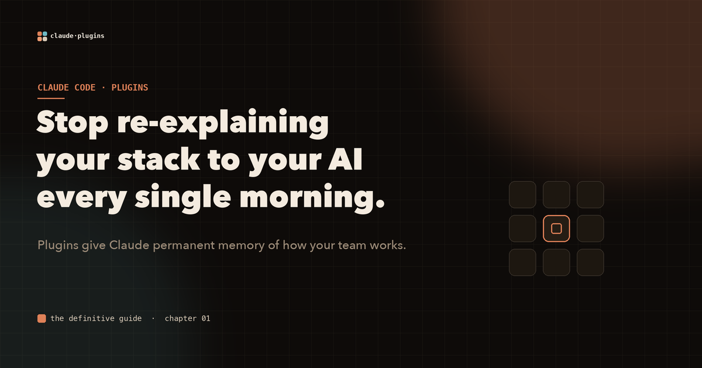
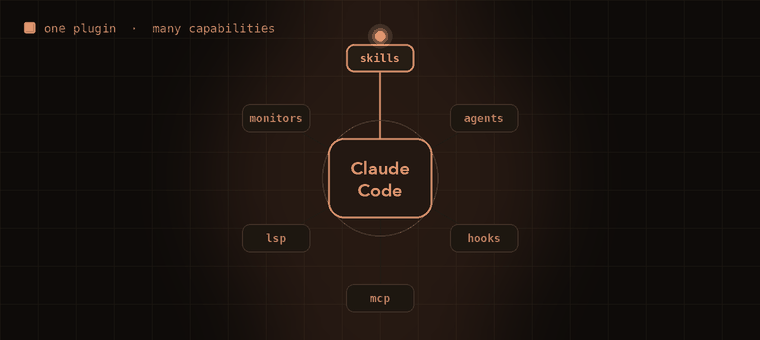
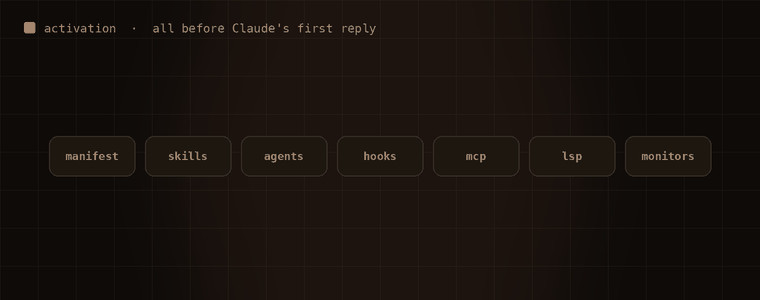

# Stop re-explaining your stack to your AI every morning

You onboard a new engineer once. You walk them through the architecture, the folder layout, the three things that look weird but exist for a reason, and the rule about never putting money in a float. After that, they remember.

Your AI coding assistant does not. Every fresh session starts from zero. "We use hexagonal architecture, the DB layer lives in `src/infra/`, money is always `int64` cents, never call external HTTP from the domain layer." You type it again. And again. It is the most expensive copy-paste of your week.

Claude Code plugins exist to end that. A plugin is a self-contained, installable bundle of capabilities that Claude loads, understands, and acts on, so the context that used to live in your head (and your clipboard) now lives in the tool.

## One bundle, six kinds of power

A plugin is not a prompt wrapper. It is a composable unit that can carry any combination of six things: **skills** (reusable instruction sets), **agents** (specialized sub-assistants with their own tools), **hooks** (scripts that fire on events), **MCP servers** (live integrations with your APIs), **LSP servers** (real code intelligence), and **background monitors** (watchers that stream context as things happen).

Install one and Claude Code lights up with all of them at once.

*One plugin can carry skills, agents, hooks, MCP servers, LSP servers, and monitors. Claude sees them all the moment it is enabled.*

The mental model that makes this click: **if Claude Code is the operating system, plugins are the applications.** You do not reinstall your editor every time you open a file. You should not re-teach your assistant every time you open a session.

## It is all ready before you type a word

When Claude Code starts with a plugin enabled, the loading happens in a fixed order, and all of it finishes before Claude's first response. The manifest registers the plugin's identity, skills join the command list, agents load into the registry, hooks arm themselves for lifecycle events, MCP and LSP servers boot as child processes, and monitors begin streaming.

*Manifest, skills, agents, hooks, MCP, LSP, monitors. A scanning loader brings each one online before you ask your first question.*

You never see the boot sequence. You just notice that Claude already knows your conventions.

## When to reach for a plugin

The honest answer is: not always. If it is just you, on one project, for a quick experiment, a standalone `.claude/` directory is faster to set up and perfectly fine. The moment any of these become true, build a plugin instead:

- more than one person will use it
- it works across several projects
- it needs versioning and a controlled rollout
- it depends on external services like MCP or LSP servers

The dividing line is **shareability and namespace isolation**. Standalone config is a sticky note. A plugin is institutional memory.

## The payoff

Encode your team's "way we do things" once and it becomes permanently available and automatically applied, instead of sitting in a wiki your assistant cannot read. Ship it org-wide and every engineer's Claude Code starts from the same baseline. Update it once and the change reaches everyone.

That is the difference between an assistant that needs a briefing every morning and one that already works here.

---

**This is one chapter of a much larger field guide.** The full interactive version covers all nine building blocks, the security model, workflow automation, and the production-grade architecture patterns, all drawn out with animated diagrams.

**Explore the complete visual guide → [The Definitive Guide to Claude Code Plugins](https://github.com/Sagart-cactus/learn-claude-code-plugin)**
