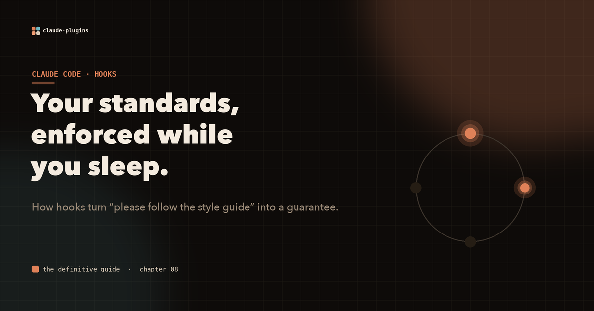
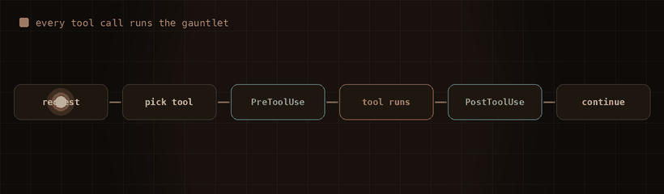
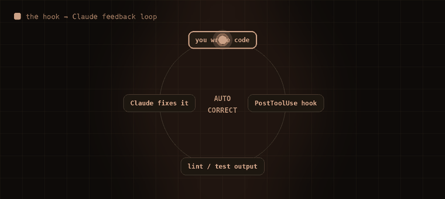

# Your team's standards keep getting ignored. Hooks fix that for good.

Every team has a style guide nobody fully reads and a linter someone quietly disables when it gets annoying. You write the conventions down. You mention them in code review. And they still erode, one "I'll fix it later" at a time.

The reason is simple: standards that depend on a human remembering to apply them will eventually be forgotten. The fix is to make them not depend on a human at all.

In Claude Code, that mechanism is a **hook**: an event-driven script that fires automatically on lifecycle events like `PreToolUse` and `PostToolUse`. A hook is how "please follow the style guide" becomes a guarantee instead of a request.

## Every tool call runs the gauntlet

Before Claude runs any tool, `PreToolUse` hooks fire. After it finishes, `PostToolUse` hooks fire. Each hook receives a JSON description of the call on stdin and can allow it, block it, or hand structured context back to Claude.



*Nothing reaches your filesystem without passing through the hooks you defined. Exit 0 to allow, non-zero to block, or return JSON to inform Claude's next move.*

A `PostToolUse` hook matched to `Write|Edit` that runs your linter means code that violates your style never survives. There is no human review step for mechanical checks, because there does not need to be one.

## The part most people miss

Most hook examples stop at "validate or block." That is the boring half. The powerful half is that **a hook's stdout is fed straight back to Claude.**

So you do not just fail the build. You hand Claude the exact error, and it fixes it.



*Write code, the hook runs your linter or type-checker, the output flows back, Claude reads it and corrects the file. A closed loop with no human in the middle.*

Structure that output as actionable data and it gets even better. Instead of a wall of text, return JSON:

```bash
jq -r '.tool_input.file_path' | xargs eslint --format json 2>/dev/null | \
  jq '[.[] | select(.errorCount > 0)
       | {file: .filePath, errors: [.messages[] | {line, message, ruleId}]}]'
```

Now Claude knows precisely what to fix and where. No guessing, no re-reading the whole file.

## Four jobs hooks are built for

Once you see hooks as the workflow glue, the uses fall into four buckets:

- **Auto-correct**: lint and format the instant code is written
- **Auto-verify**: run tests after any implementation change
- **Auto-document**: update a changelog after significant edits
- **Auto-notify**: post to Slack when a milestone lands

## One warning before you ship

Hooks are the most powerful surface in a plugin, which makes them the most dangerous one too. They run shell commands with whatever the input contains. Treat that input as hostile:

- always quote your variables: `"$FILE_PATH"`, never `$FILE_PATH`
- parse with `jq` and pull specific fields, never `eval` the whole blob
- reject path traversal and shell metacharacters before using a value
- never pipe user-provided content straight into `sh` or `bash`

A hook that enforces your standards is a gift. A careless one is a remote code execution waiting to happen. Build them defensively and they become the quiet enforcement layer your team always wished it had.

---

**This is one chapter of a much larger field guide.** The full interactive version covers the entire hook lifecycle, the four automation patterns, and how to compose skills and hooks into one-command workflows, all with animated diagrams.

**Explore the complete visual guide → [The Definitive Guide to Claude Code Plugins](https://sagart-cactus.github.io/learn-claude-code-plugin/)**
