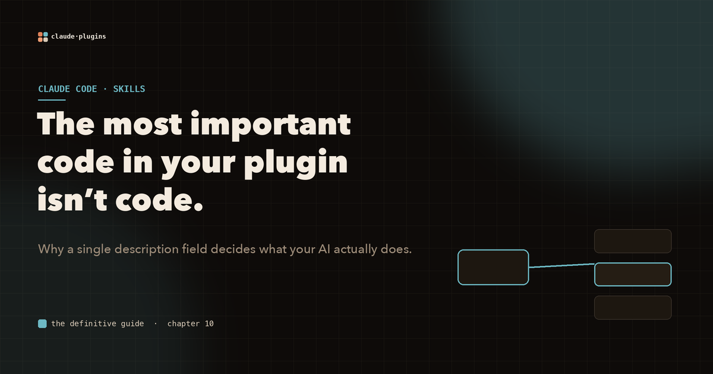
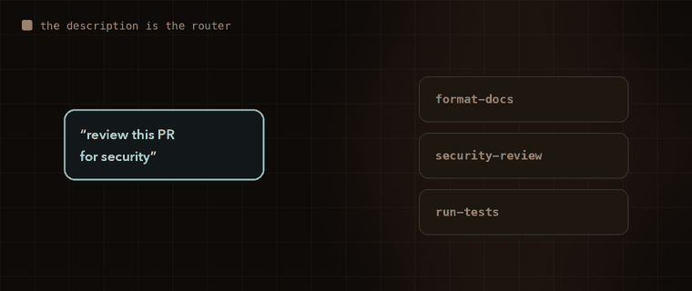

# The most important code in your plugin isn't code

You can write a genuinely useful tool, wire it up perfectly, and then watch your AI assistant never reach for it. You ask it to do exactly the thing your tool was built for, and it improvises something else instead.

Nine times out of ten, the tool is fine. The problem is one sentence: the **description**.

Every resource about Claude Code plugins obsesses over file structure. Almost none of them tell you the single highest-leverage thing you can do, which is write a precise description. Claude's decision to use a skill rests entirely on what that description says.

## Descriptions are a routing table

When a task comes in, Claude does not run your skill because of its name or its folder. It reads the descriptions of everything available and routes the task to whatever fits.



*"Review this PR for security" scans the available skills and locks onto the one whose description matches. Get the wording wrong and it picks the wrong door, or no door at all.*

Watch what changes between a weak description and a strong one:

```yaml
# Weak. Claude has nothing to match against.
description: Code review helper

# Strong. Claude knows exactly when this fires.
description: Reviews code changes for security vulnerabilities and style
  issues. Use when the user asks to review a PR, audit a diff, check code
  quality, or before merging any branch.
```

The strong one names the triggers. That is the whole game.

## Say what it is NOT for

Here is the move most people skip. A great description includes **negative constraints**: the situations where the skill should stay out of the way.

```yaml
description: Reviews TypeScript code for type safety and runtime errors.
  Use when reviewing TS files. Do NOT use for JavaScript, Python, or
  configuration files.
```

Without that line, Claude will cheerfully over-apply your skill to contexts where it does nothing useful. The "do not" is as important as the "do."

## The test that tells you it works

There is a dead-simple way to check a description. Describe a scenario to Claude **without naming the skill**, and see if it reaches for it on its own. If it does, your description is doing its job. If it does not, rewrite it and try again. You are debugging a sentence the same way you would debug a function.

## This applies to your MCP tools too

The same rule governs every tool you ship through an MCP server. Each tool's description is Claude's decision criterion for calling it, so write them with the same care:

```text
# Weak
name: create_issue
description: Creates an issue

# Strong
name: create_issue
description: Creates a new GitHub issue in the specified repository. Use
  when the user asks to file a bug, report a problem, track a task, or
  create a ticket. Requires repository name and issue title at minimum.
```

## The takeaway

You will spend hours on directory layout, manifests, and component wiring. Spend a few of those minutes on the descriptions instead. They are the interface between your intent and your AI's behavior, and they are the part that decides whether any of the rest of it ever runs.

The most important code in your plugin is the prose.

---

**This is one chapter of a much larger field guide.** The full interactive version covers skills, agents, the orchestrator model, and the advanced patterns that the usual tutorials never get to, all with animated diagrams.

**Explore the complete visual guide → [The Definitive Guide to Claude Code Plugins](https://sagart-cactus.github.io/learn-claude-code-plugin/)**
