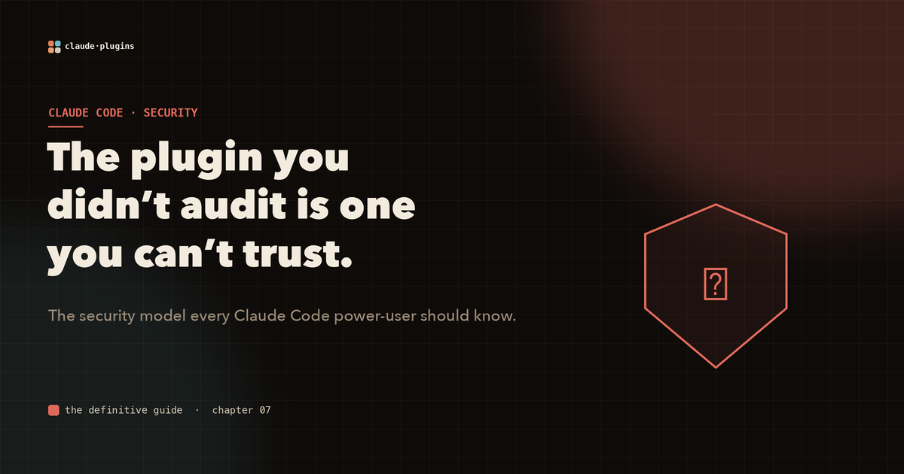
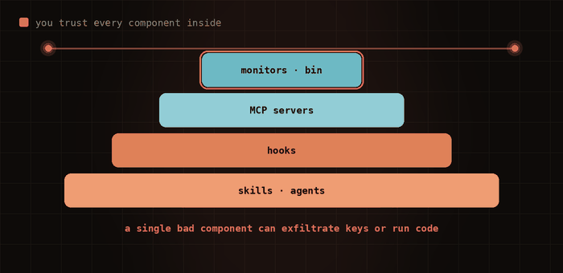
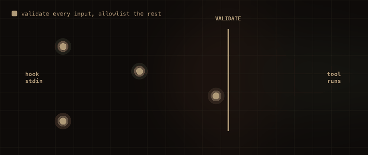

# A plugin you didn't audit is a plugin you don't trust

Installing a plugin is one of the most trusting things you do all day, and you probably do it without reading a single line of what's inside.

Think about what an install actually means. The moment a plugin is enabled, you have handed it the ability to run skills, spawn agents, fire shell hooks, start MCP servers, and stream from background monitors, all inside your environment, with your credentials in reach. That trust is transitive, and it is usually opaque.

This is not hypothetical. Real CVEs have already exploited exactly this surface: remote code execution through malicious hooks planted in a repository's settings file, and API-key exfiltration through a rogue MCP server overriding environment variables.

## You trust the whole pyramid

When you trust a plugin, you trust every component inside it, all at once. A single bad one is enough.



*Skills, agents, hooks, MCP servers, monitors, executables. Each layer is a way in. One malicious component in an otherwise helpful plugin can exfiltrate keys or run arbitrary code.*

That is the threat. Here is the discipline that contains it.

## Least privilege, component by component

The principle is old and it still wins: give each component only what it needs, and nothing more.

- **Skills**: declare the tools you actually use. Reading logs? `tools: Read, Glob`, and nothing else.
- **Agents**: explicit tool lists, always. A documentation writer needs `Read, Write, Glob`, not `Bash`.
- **MCP servers**: treat each as its own trust boundary. Ship only servers you control or have audited. Reference secrets through environment variables, never hardcode them, and scope tokens to the minimum. Prefer read-only.
- **Hooks**: the most dangerous surface, covered next.

## Treat every input as hostile

Hooks receive JSON from Claude on stdin. That is untrusted input, full stop. The job of a hook is to validate first and act second, and to allowlist what is permitted rather than trying to blocklist what isn't.



*Well-formed calls pass the gate. The malicious payload is stopped at the boundary. Validate, allowlist, then run.*

In practice that looks like this:

```bash
# Extract and validate; treat stdin as untrusted
FILE_PATH=$(echo "$STDIN" | jq -r '.tool_input.file_path // empty')
if [ -z "$FILE_PATH" ]; then exit 0; fi
# Reject path traversal
case "$FILE_PATH" in *../*) exit 1 ;; esac
```

Always quote your variables (`"$FILE"`, never `$FILE`), parse specific fields with `jq` instead of evaluating the whole blob, and never pipe user-provided content into `sh`.

## The checklist before you publish

Before any plugin reaches another person, walk this list:

- no hardcoded secrets anywhere
- every hook command uses quoted variables
- MCP servers pin exact dependency versions
- agents have explicit tool restrictions
- `claude plugin validate` passes with no warnings
- the README documents every required environment variable
- tested in a sandboxed container or VM, never as root
- no unnecessary network access
- least privilege applied to every single component

Powerful tools deserve careful owners. The plugin model gives you real leverage, and this is the price of holding it responsibly.

---

**This is one chapter of a much larger field guide.** The full interactive version covers the complete trust model, secret management, supply-chain risk, and the architecture patterns that keep plugins safe at scale, all with animated diagrams.

**Explore the complete visual guide → [The Definitive Guide to Claude Code Plugins](https://github.com/Sagart-cactus/learn-claude-code-plugin)**
