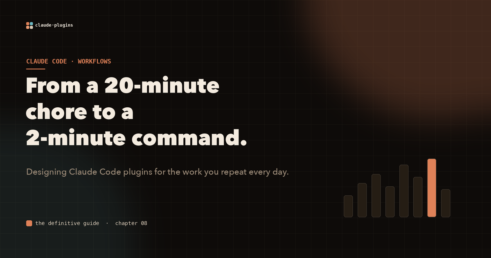
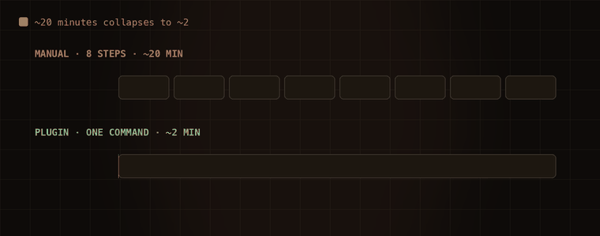

# How to turn a 20-minute chore into a 2-minute command

Picture the task you have done so many times your hands move on their own. The PR review. The pre-deploy checklist. The support-ticket triage. None of it is hard. All of it is friction, repeated, forever.

Here is what that friction actually looks like for a single pull request:

1. open the PR and copy the diff into a chat
2. type "review this for security"
3. read the findings
4. create the GitHub comments by hand
5. update the ticket in Jira
6. run the linter manually
7. fix what it flags

Call it twenty minutes. Now multiply by every PR, every week, for your whole team.

## The same work, collapsed into one command

A plugin turns that sequence into a single invocation. `/pr-tools:full-review PR-456` and the rest happens on its own: it fetches the diff through the GitHub MCP server, a `security-reviewer` agent analyzes it, a `PostToolUse` hook runs the linter, the GitHub MCP posts the review comments, and the Jira MCP updates the ticket. About two minutes, zero copy-paste.



*The manual workflow crawls through eight steps. The plugin finishes in a single pass. Same outcome, a tenth of the time.*

The trick to designing one of these is to map the "before" in detail first. Every manual step you write down is a candidate for automation.

## Four patterns cover almost everything

Most useful workflow skills are one of four shapes:

- **Context loader**: primes Claude with everything it needs at the start of a task. No action, just context.
- **Workflow executor**: runs a multi-step process in order (fetch, analyze, act, report) and stops the moment a step fails.
- **State-aware operator**: checks external state through MCP tools and acts conditionally. Classify a ticket, then branch.
- **Feedback loop**: a skill paired with hooks for continuous improvement. Write the test, run it, implement, verify, refactor.

A pre-deploy executor reads as plainly as the runbook it replaces:

```markdown
---
description: Run the full pre-deployment checklist. Use before any
  production deployment.
---
# Pre-Deploy Checklist
Run these IN ORDER and stop if any fail:
1. `npm run test:all` must pass 100%
2. `npm run build` must produce zero warnings
3. confirm all commits in `main..HEAD` are reviewed
4. verify every var in `.env.production.example` is set
5. `npm run db:migrate:dry-run` must report a safe migration
```

## Hooks are what make it automatic

Skills describe the work. Hooks make it run without you. Because a hook's output flows back to Claude, a failing test in a `PostToolUse` hook is not a dead end, it is the next instruction. Claude reads the failure and fixes it, then the loop continues.

Compose small skills into bigger ones and the leverage compounds. A `fetch-pr`, a `security-check`, and a `post-review` skill each do one job. A `full-review` skill calls all three in sequence. You build the atoms once and assemble the workflows on top.

## Where to start

Find the task you resent most this week. Write down every manual step. Then ask which steps are a skill, which are a hook, and which need an MCP tool to reach the outside world. That list is your first plugin, and it is the one that will pay you back fastest.

The work you repeat is the work worth automating.

---

**This is one chapter of a much larger field guide.** The full interactive version covers all four automation patterns, stateful workflows with monitors, and how to compose skills into production-grade pipelines, all with animated diagrams.

**Explore the complete visual guide → [The Definitive Guide to Claude Code Plugins](https://github.com/Sagart-cactus/learn-claude-code-plugin)**
